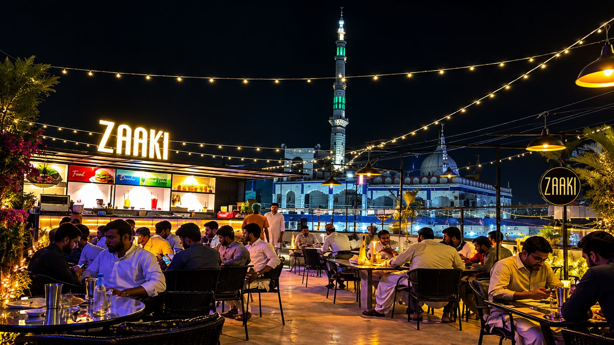
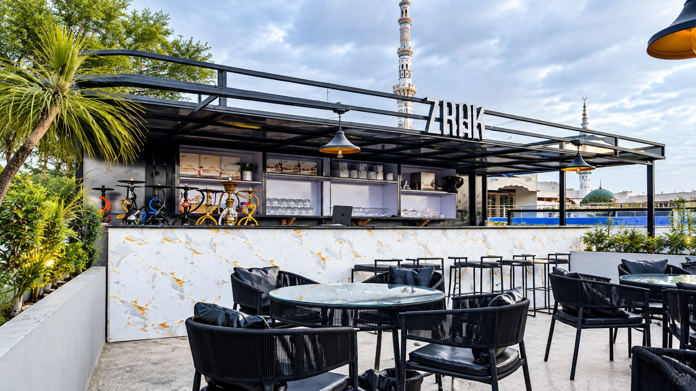
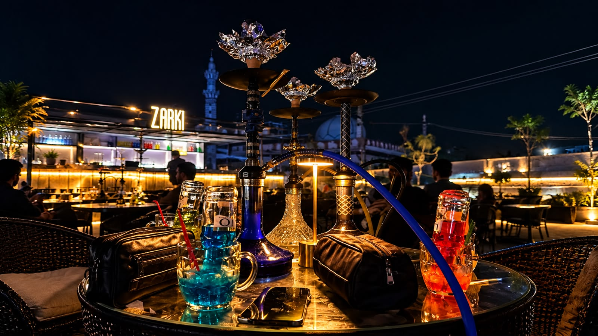
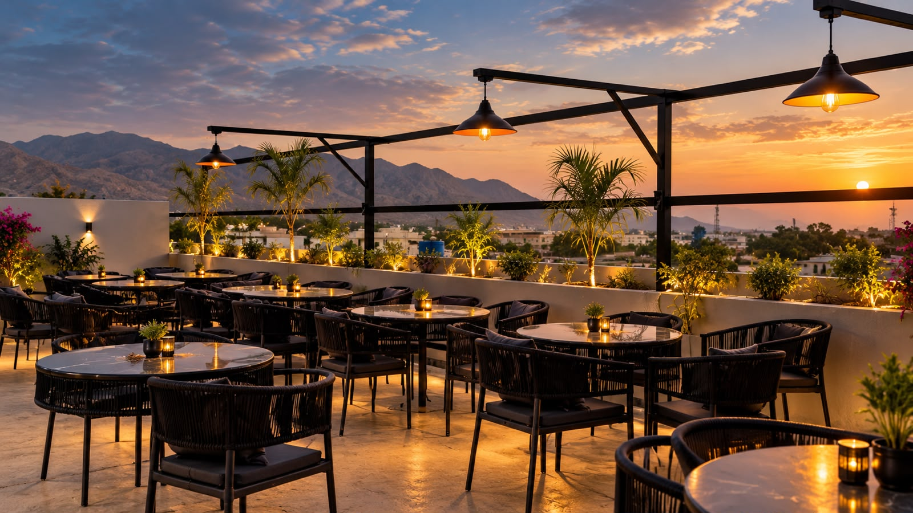
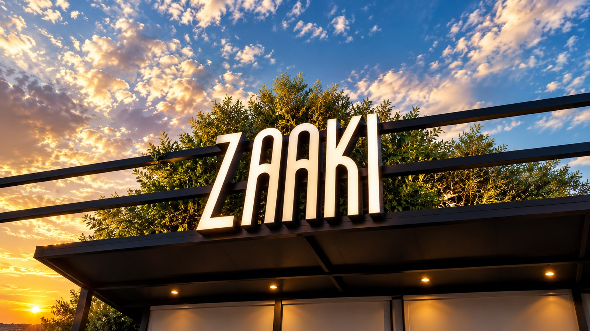
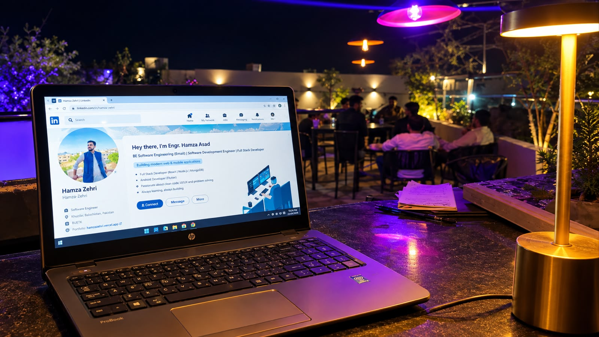

# Zaaki Rooftop Website

Landing page for **New Kabul Jan Restaurant &amp; Zaaki Rooftop** — a rooftop dining experience in **Khuzdar, Balochistan**.


## Features

- **Hero landing** with rooftop ambiance imagery and call-to-action
- **Full menu** with tabbed categories:
  - Starters, Kebabs &amp; Pulao (Kabuli Pulao, Sada/Pelator variants, Chicken Biryani)
  - Chicken Karahi &amp; Handi (Red / White · Full/Half)
  - Mutton, Chargha &amp; Dampukht (full damage sizes 1.5–5 kg)
  - Family Deals (2 / 4 / 6 / 8 persons)
  - Drinks &amp; Shisha Lounge
- **Interactive table reservation modal**:
  - 3 seating zones — Rooftop Open-Air (12), Family Hall (12), Main Hall (12)
  - Live table selection with capacity badges
  - Seating preference dropdown
  - Formspree-backed submission (`https://formspree.io/f/xwlknbkj`)
- **Photo gallery** — main page section (6 images) plus an ambiance gallery inside the reservation popup
- **Google Maps embed** for location
- **Direct call / WhatsApp** links (`tel:+923337997897`)
- **Smooth-scroll navigation** with mobile-friendly tabs

## Gallery

Swappable images in the `images/` folder:

| | | |
| --- | --- | --- |
|  |  |  |
|  |  |  |

## Variants

The repo ships 6 self-contained variants so the owner can compare layouts:

| Variant | Description |
| --- | --- |
| `new_kabul_jan_restaurant_zaaki_rooftop_1` | Full page with reservation system |
| `..._2` | Menu-catalog layout with reservation system |
| `..._3` | Alternate menu-catalog layout with reservation system |
| `..._4` | Full page with reservation system |
| `..._5` | Main variant with reservation system |
| `..._6` | Reference variant with reservation system |

Each variant is a single `code.html` file (Tailwind CSS via CDN) and is independently deployable.

## Tech Stack

- Plain **HTML5 + CSS3** (utility-first layout)
- **Tailwind CSS** via CDN (`cdn.tailwindcss.com`)
- **Vanilla JavaScript** (tab switching, gallery, reservation modal)
- **Google Fonts** — Material Symbols
- **Formspree** — reservation form submissions
- **Python `http.server`** for local development

## Local Development

```bash
cd stitch_new_kabul_jan_landing_page
python -m http.server 8080
```

Then open:

- http://localhost:8080/new_kabul_jan_restaurant_zaaki_rooftop_1/code.html
- http://localhost:8080/new_kabul_jan_restaurant_zaaki_rooftop_6/code.html

> The gallery images live in `images/` — swap the files there (keeping the same names) to update the photos.

## Project Structure

```
.
├── README.md
├── images/                        # All site images (swap here to update)
│   ├── rooftop-twilight.png
│   ├── family-majlis.jpg
│   ├── samovar-lounge.jpg
│   ├── starry-dastarkhwan.jpg
│   ├── 1.jpeg
│   ├── 2.jpeg
│   ├── map-background.png
│   └── logo.png
├── new_kabul_jan_zaaki_rooftop_logo/screen.png   # Header logo
├── new_kabul_jan_restaurant_zaaki_rooftop_1/code.html   ... _6/code.html
└── new_kabul_jan_restaurant_zaaki_rooftop/DESIGN.md
```

## Contact

- **Phone / WhatsApp:** +92 333 7997897
- **Location:** Main Khuzdar, Balochistan